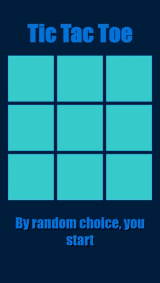

TicTacToe
----
- Tic-Tac-Toe game implemented using Javascript. Also implemented a minimax algorithm based AI to play against the user. 
- Minimax algorithm is an Artificial Intelligence/Game Theory alorithm that determines the optimal move to be played given the state of the board. Also called as "unbeatable" AI in TicTacToe.

Algorithm
----
- findBestMove() is the function that will be called each time the computer has to make a move
````function findBestMove(board):
    bestMove = NULL
    for each move in board :
        if current move is better than bestMove
            bestMove = current move
    return bestMove
````
- minimax() is the function that determines the cost of every move made by the computer
````
function minimax(board, depth, isMaximizingPlayer):
    if current board state is a terminal state :
        return value of the board
    if isMaximizingPlayer :
        bestVal = -INFINITY 
        for each move in board :
            value = minimax(board, depth+1, false)
            bestVal = max( bestVal, value) 
        return bestVal
    else :
        bestVal = +INFINITY 
        for each move in board :
            value = minimax(board, depth+1, true)
            bestVal = min( bestVal, value) 
        return bestVal
````

Thanks to [GeeksForGeeks](https://www.geeksforgeeks.org/minimax-algorithm-in-game-theory-set-3-tic-tac-toe-ai-finding-optimal-move/) for the algorithm.

Screenshots
---
## Mobile


## Web
|State|Screenshot|
|---|---|
|Initial Page||
|Computer Wins||
|Draw Game||
